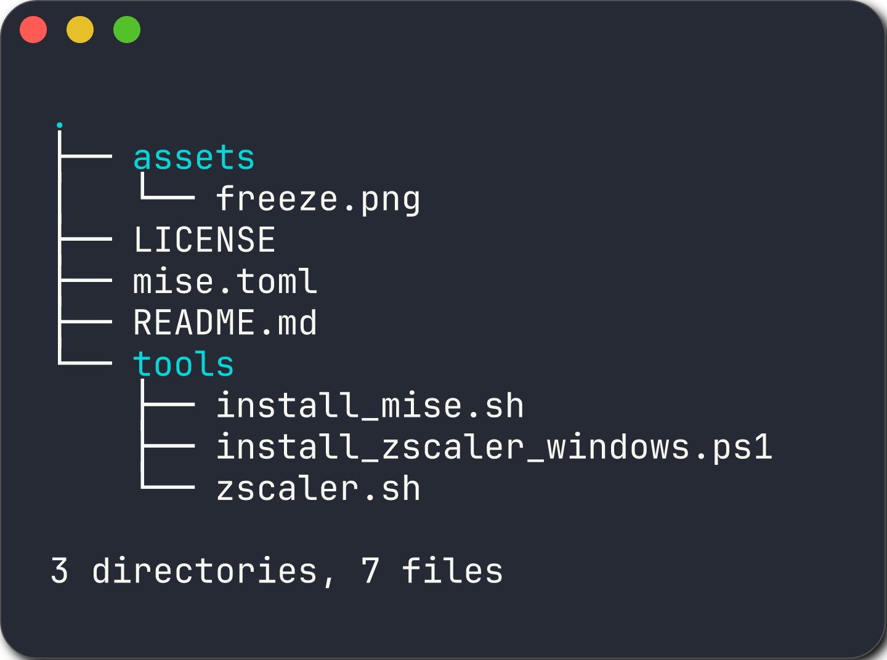

This repository contains a collection of scripts and tools designed to accelerate and standardise development environments for engineers at NCS Australia.

The goal is to automate common setup tasks, eliminate friction, and ensure a consistent, high-quality experience for everyone.

---


Here's the list of tools and scripts available in this repository:



### :zap: Zscaler Certificate Fixer

This tool automatically configures your development environment to work seamlessly behind the NCS Zscaler proxy. It fetches the required Zscaler CA certificates, creates a unified trust store, and configures all major tools (`git`, `gcloud`, `pip`, `npm`, `curl`, etc.) to use it.

This solves the common "certificate validation" and "untrusted SSL certificate" errors.

#### **Installation (macOS / Linux)**

Run the following command in your terminal (`zsh` or `bash`):

```bash
curl -sSL https://raw.githubusercontent.com/withriley/engineer-enablement/main/tools/zscaler.sh -o /tmp/zscaler.sh && zsh /tmp/zscaler.sh
```

#### **Installation (Windows)**

Run the following command in an **Administrator PowerShell** session:

```powershell
Set-ExecutionPolicy Bypass -Scope Process -Force; $scriptPath = Join-Path $env:TEMP "install_zscaler_windows.ps1"; Invoke-RestMethod -Uri "[https://raw.githubusercontent.com/withriley/engineer-enablement/main/tools/install_zscaler_windows.ps1?_=$(Get-Date](https://raw.githubusercontent.com/withriley/engineer-enablement/main/tools/install_zscaler_windows.ps1?_=$(Get-Date) -UFormat %s)" -OutFile $scriptPath; & $scriptPath
```

---

### :sparkles: Mise Environment Setup

This script automates the complete installation and configuration of `mise`, our standard tool for managing different versions of command-line tools like `terraform`, `go`, `node`, `python`, and more.

**Prerequisite:** You must run the **Zscaler Certificate Fixer** script first.

#### **Installation (macOS / Linux)**

Run the following command in your terminal (`zsh` or `bash`):

```bash
curl -sSL "https://raw.githubusercontent.com/withriley/engineer-enablement/main/tools/install_mise.sh?_=$(date +%s)" -o /tmp/install_mise.sh && zsh /tmp/install_mise.sh
```

---


### 🤝 Contributing

Contributions are welcome! If you have an idea for a new script or an improvement to an existing one, please follow these steps:

1. **Fork** the repository.
2. Create a new **feature branch** (`git checkout -b feature/your-new-feature`).
3. Commit your changes (`git commit -am 'Add some feature'`).
4. Push to the branch (`git push origin feature/your-new-feature`).
5. Create a new **Pull Request**.

Please ensure that any new scripts follow the established standards for user experience, dependency management, and robustness.

---

### :books: License

This project is licensed under the MIT License - see the [LICENSE](LICENSE) file for details.
